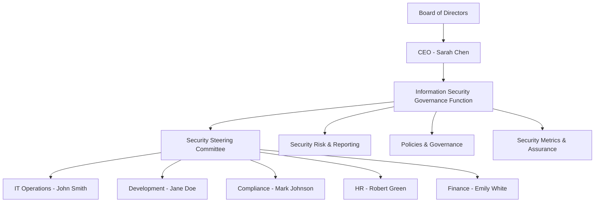

# INTERNATIONAL CYBERSECURITY AND DIGITAL FORENSICS ACADEMY (ICDFA)

## Governance, Compliance, and Risk (GCR)

### GRC102 Information Security Governance

# Week 1 Lab: Information Security Governance in Action

**Student:** Hilda Odein Joshua-Jack  
**Registration Number:** C11/26/CGRCE/17247  
**Course Code:** GRC102  
**Course Title:** Information Security Governance  
**Week's Title:** Principles of Information Security Governance  
**Credit Load:** 3 Credits  
**Cohort:** 11  
**Date:** 11th September, 2026  

---

# TABLE OF CONTENTS

1. [Governance Blueprint](#1-governance-blueprint)
   - [1.1 Current-State Governance Gap Assessment](#11-current-state-governance-gap-assessment)
   - [1.2 Proposed Organisational Chart](#12-proposed-organisational-chart)
   - [1.3 RACI Matrix](#13-raci-matrix)
   - [1.4 Governance Rationale](#14-governance-rationale)

2. [Information Security Charter](#2-information-security-charter)
   - [2.1 GHC Information Security Charter](#21-ghc-information-security-charter)
   - [2.2 CFO Justification Memo](#22-cfo-justification-memo)

3. [Board Reporting](#3-board-reporting)
   - [3.1 Board Executive Summary](#31-board-executive-summary)
   - [3.2 Selected Security Metrics](#32-selected-security-metrics)
   - [3.3 Priority Risks and Recommendations](#33-priority-risks-and-recommendations)
   - [3.4 Metric Selection Rationale](#34-metric-selection-rationale)

4. [Security Steering Committee](#4-security-steering-committee)
   - [4.1 Security Steering Committee Terms of Reference](#41-security-steering-committee-terms-of-reference)
   - [4.2 Sample First-Meeting Agenda](#42-sample-first-meeting-agenda)
   - [4.3 CEO Briefing Note](#43-ceo-briefing-note)

5. [Governance Maturity](#5-governance-maturity)
   - [5.1 Maturity Assessment](#51-maturity-assessment)
   - [5.2 12-18 Month Improvement Roadmap](#52-12-18-month-improvement-roadmap)
   - [5.3 Board-Level Executive Summary](#53-board-level-executive-summary)

6. [Conclusion](#6-conclusion)

7. [References](#7-references)

8. [AI Assistance Declaration](#8-ai-assistance-declaration)

---

# 1. GOVERNANCE BLUEPRINT

## 1.1 Current-State Governance Gap Assessment

GHC is a mid-sized health-tech company that has grown quickly, including through two acquisitions. Its use of cloud-based patient-management systems means that information security is important not only from a technical perspective but also from a business, regulatory and reputational perspective.

The current governance structure has several gaps.

| Governance Area | Current-State Gap | Risk/Impact |
|---|---|---|
| Security Ownership | Security is mainly treated as an IT responsibility. | Important security decisions may not receive enough executive attention. |
| Accountability | Roles and responsibilities for security governance are not clearly defined. | Tasks may be duplicated or missed, especially during incidents. |
| Policy Management | Policies may be inconsistent across the organisation and acquired companies. | Different teams may follow different security practices. |
| Risk Management | Security risks are handled mainly when problems occur rather than through a consistent risk-management process. | Emerging risks may not be identified early. |
| Board Reporting | Technical information is not consistently translated into business risks and impacts. | The Board may not have enough information to make informed security decisions. |
| Cross-Functional Coordination | IT, development, compliance, HR and finance do not have a formal structure for making security decisions together. | Security decisions may conflict with business or operational requirements. |
| Acquisition Integration | The two acquired companies may have different systems, policies and security practices. | Existing weaknesses may be introduced into GHC's environment. |

### Overall Assessment

The biggest governance weakness is that information security is being treated mainly as an IT issue. GHC needs a structure that gives security clear executive ownership, defined responsibilities and regular reporting to management and the Board.

---

## 1.2 Proposed Organisational Chart

The proposed structure gives the Board and CEO clear oversight while allowing different business functions to participate in security governance.

## Key Reporting Relationships

- The Board provides oversight and approves major security priorities.
- The CEO provides executive leadership and ensures security supports business objectives.
- The Information Security Governance Function coordinates governance, risk, reporting and policy activities.
- The Security Steering Committee provides cross-functional oversight and decision-making.
- IT, Development, Compliance, HR and Finance contribute their specific responsibilities to security governance.

---

## 1.3 RACI Matrix

## 1.3 RACI Matrix

**R = Responsible**  
**A = Accountable**  
**C = Consulted**  
**I = Informed**

| Activity | Board | CEO | Security Governance | IT Manager | Compliance | HR | Development |
|---|---|---|---|---|---|---|---|
| Approve security policy | A | R | C | C | C | I | I |
| Review enterprise security risks | A | A | R | C | C | I | C |
| Incident response planning | I | A | R | R | C | C | C |
| Security awareness | I | A | R | C | C | R | I |
| Access governance | I | A | R | R | C | C | C |
| Regulatory compliance monitoring | I | A | R | C | R | C | I |
| Security metrics and Board reporting | A | A | R | C | C | I | I |
| Security Steering Committee decisions | I | A | R | R | R | C | C |

---

## 1.4 Governance Rationale

The proposed structure is designed to make security a shared organisational responsibility rather than something handled only by IT.

First, it creates clear accountability. Each major security activity has an identified owner, reducing confusion about who should act.

Second, it improves transparency. Security risks, incidents and performance can be reported to management and the Board in a consistent way.

Third, it supports business alignment. GHC is expanding into new regional markets and developing AI-based solutions. Security governance therefore needs to consider business objectives when making security decisions.

Finally, the structure supports better risk management because security, compliance, finance, HR, development and IT can contribute to decisions that affect their areas.

---

## 2. INFORMATION SECURITY CHARTER

### 2.1 GHC Information Security Charter

#### 2.1.1 Purpose

The purpose of the GHC Information Security Charter is to establish a clear framework for managing and governing information security across the organisation.

The charter defines the authority, responsibilities and principles that guide GHC's information security activities. It also ensures that security decisions support GHC's business objectives while protecting customer information and other sensitive data.

#### 2.1.2 Scope

This charter applies to:

- All GHC employees and contractors.
- All information systems and technology used by GHC.
- Cloud-based patient-management systems.
- Customer, patient, employee and business information.
- Acquired companies and their systems where applicable.
- Third-party services that process or have access to GHC information.

#### 2.1.3 Authority

The Board provides overall oversight of information security governance.

The CEO is responsible for ensuring that information security receives appropriate executive attention and resources.

The Information Security Governance Function is authorised to coordinate security governance activities, monitor security risks, maintain governance documentation and report security matters to management and the Board.

The Security Steering Committee is authorised to review security risks, policies, incidents and priorities and to make recommendations or decisions within its approved authority.

#### 2.1.4 Roles and Responsibilities

**Board of Directors**

- Provide oversight of information security.
- Review significant security risks.
- Approve major security priorities and strategic direction.
- Receive security performance and risk reports.

**CEO**

- Provide executive leadership for information security.
- Ensure security supports business objectives.
- Approve key governance decisions and provide necessary resources.

**Information Security Governance Function**

- Coordinate information security governance.
- Maintain security policies and governance documents.
- Monitor security risks.
- Coordinate reporting and assurance activities.
- Support the Security Steering Committee.

**IT Manager**

- Implement and maintain technical security controls.
- Manage IT security operations.
- Support access control, incident response and vulnerability management.

**Compliance Officer**

- Monitor regulatory and compliance requirements.
- Support compliance assessments.
- Report significant compliance gaps.

**HR Manager**

- Support security awareness and training.
- Coordinate security requirements relating to employees.
- Support joiner, mover and leaver processes.

**Development Team**

- Integrate security into application development.
- Address application vulnerabilities.
- Support secure software development practices.

**Finance**

- Support security budgeting and investment decisions.
- Consider financial impacts when assessing security risks.

#### 2.1.5 Key Principles

GHC's information security governance will be guided by the following principles:

**Risk-based decision-making**
Security resources should be focused on the most significant risks.

**Business alignment**
Security should support GHC's business objectives and growth plans.

**Proportionate controls**
Controls should be appropriate to the level of risk.

**Accountability**
Security responsibilities should be clearly assigned.

**Least privilege**
Users should receive only the access required to perform their responsibilities.

**Continuous improvement**
Security governance should be reviewed and improved as GHC grows.

**Transparency**
Significant security risks and issues should be communicated to the appropriate decision-makers.

**Protection of sensitive information**
Patient, customer, employee and business information should be protected from unauthorised access, loss or disclosure.

#### 2.1.6 Reporting Structure

The Information Security Governance Function will provide regular reports to the CEO and Security Steering Committee.

Significant security risks, incidents and governance issues will be escalated to the Board where appropriate.

Reports should include meaningful security metrics, trends, major risks, control weaknesses and recommended actions.

#### 2.1.7 Review and Approval

The Information Security Charter should be reviewed at least annually and whenever there are significant changes to GHC's business, technology, regulatory environment or risk profile.

The Board and CEO are responsible for approving the charter and significant amendments.

---

### 2.2 CFO Justification Memo

To: Marcus Thorne, Chief Financial Officer
From: Information Security Governance Function
Subject: Business Justification for the GHC Information Security Charter
Date: 11th September 2026

**Purpose**

The proposed Information Security Charter provides GHC with a clear governance structure for managing information security as the organisation continues to grow.

GHC's expansion into new markets, recent acquisitions and planned use of AI technologies increase the importance of having consistent security governance.

**Business Value**

The charter provides several benefits.

1. Supports business growth

As GHC expands into new regional markets, a consistent approach to security will help reduce the risks associated with new systems, users, suppliers and regulatory requirements.

2. Protects customer trust

GHC handles sensitive health-related and customer information. Strong governance helps reduce the likelihood and impact of data breaches that could damage the organisation's reputation.

3. Improves investment decisions

The charter creates clearer responsibilities for identifying and reporting security risks. This gives management better information when deciding where security investment is needed.

4. Supports efficiency

A defined governance structure reduces duplicated efforts and confusion between IT, compliance, development and other functions.

5. Supports innovation

GHC's plans to introduce AI diagnostics and secure data exchange require security to be considered from the beginning rather than added later.

6. Supports regulatory compliance

The charter gives compliance activities a formal place within security governance and provides clearer reporting and accountability.

**Conclusion**

The charter is not only a security document. It provides a practical framework for protecting GHC's information, supporting business growth and making better security investment decisions.

---

## 3. BOARD REPORTING

### 3.1 Board Executive Summary

Current Security Posture:  RED

The security data for the six-month period from September to February shows that GHC's overall security posture requires attention.

Phishing attempts increased from 150 in September to 320 in February, representing an increase of approximately 113%.

Malware incidents also increased from 25 to 50, doubling during the period.

Critical vulnerability patching declined from 67% to 55%, meaning that a smaller proportion of critical vulnerabilities were being addressed.

Security training completion improved from 45% to 70%, which is a positive trend. However, the improvement in training has not yet translated into a reduction in phishing attempts or high-risk incidents.

High-risk security incidents increased from 2 to 7 during the period.

The most urgent areas for management attention are vulnerability management, increasing security incidents and employee susceptibility to phishing.

### 3.2 Selected Security Metrics

| Metric | September | October | November | December | January | February | Trend |
|--------|-----------|---------|----------|----------|---------|----------|-------|
| Phishing Attempts | 150 | 180 | 210 | 250 | 280 | 320 | Increasing |
| Malware Incidents | 25 | 30 | 35 | 40 | 45 | 50 | Increasing |
| Critical Vulnerabilities Patched | 67% | 60% | 60% | 60% | 57% | 55% | Declining |
| Security Training Completion | 45% | 50% | 55% | 60% | 65% | 70% | Improving |
| High-Risk Incidents | 2 | 3 | 4 | 5 | 6 | 7 | Increasing |

**Metric Commentary**

**Phishing Attempts**

Phishing attempts increased significantly from 150 to 320. This indicates increased external pressure and continued exposure to social engineering threats.

**Malware Incidents**

Malware incidents increased from 25 to 50. The increase suggests that existing preventive controls may need to be strengthened.

**Critical Vulnerability Patching**

Critical vulnerability patching declined from 67% to 55%. This is a major concern because unresolved critical vulnerabilities can provide attackers with opportunities to compromise systems.

**Security Training Completion**

Training completion increased from 45% to 70%. This is positive, although further work is required to ensure that employees can apply the training in real situations.

**High-Risk Incidents**

High-risk incidents increased from 2 to 7. This trend requires management attention because it suggests that the organisation's overall exposure is increasing.

### 3.3 Priority Risks and Recommendations

**Priority Risk 1: Increasing Security Incidents**

The increase in phishing, malware and high-risk incidents indicates that GHC is experiencing growing security pressure.

Recommendation:

GHC should strengthen security awareness activities by introducing practical phishing exercises, targeted awareness sessions and regular reminders about suspicious emails and links.

**Priority Risk 2: Declining Vulnerability Patching**

Critical vulnerability patching decreased from 67% to 55% over the reporting period.

Recommendation:

GHC should establish clear patching deadlines based on vulnerability severity, assign control owners and introduce escalation when critical vulnerabilities remain unresolved.

**Additional Management Actions**

- Review the root causes of high-risk incidents.
- Improve monitoring and incident reporting.
- Track overdue critical vulnerabilities.
- Provide additional awareness training to high-risk user groups.
- Report unresolved high-risk issues to the Security Steering Committee.

### 3.4 Metric Selection Rationale

The selected metrics provide a balanced view of GHC's security posture.

Phishing attempts and malware incidents show the level of external and technical security pressure affecting the organisation.

Critical vulnerability patching measures how effectively GHC is addressing an important technical control.

Security training completion measures employee awareness and participation.

High-risk incidents provide an indication of the actual impact of security weaknesses.

Together, these metrics provide information about threats, control performance, human behaviour and security outcomes rather than focusing only on technical activity.

---

## 4. SECURITY STEERING COMMITTEE

### 4.1 Security Steering Committee Terms of Reference

#### 4.1.1 Purpose

The Security Steering Committee (SSC) provides a formal cross-functional forum for discussing and making decisions about information security governance, risks, policies and priorities.

The committee ensures that security decisions consider technical, business, regulatory and operational requirements.

#### 4.1.2 Scope

The SSC will consider:

- Information security risks.
- Security policies and standards.
- Major security incidents.
- Security metrics and trends.
- Regulatory and compliance issues.
- Security awareness.
- Access governance.
- Vulnerability management.
- Security requirements for new projects and technologies.
- Security implications of acquisitions.

#### 4.1.3 Membership

The committee will include:

- CEO - Sarah Chen: Chair
- Information Security Governance Lead: Security governance coordination
- IT Manager - John Smith: IT operations and technical security
- CTO / Development Representative - Jane Doe: Application and technology security
- Compliance Officer - Mark Johnson: Compliance and regulatory requirements
- HR Manager - Robert Green: People and awareness matters
- Finance Representative - Emily White: Financial and investment considerations

Subject matter experts may be invited when required.

#### 4.1.4 Responsibilities

The SSC will:

- Review significant security risks.
- Monitor security metrics and trends.
- Review security policies and governance documents.
- Review major security incidents and lessons learned.
- Prioritise security improvement activities.
- Consider security implications of new projects and acquisitions.
- Resolve cross-functional security issues.
- Escalate significant matters to the CEO or Board.

#### 4.1.5 Meeting Frequency

The committee will meet monthly.

Additional meetings may be called when there is a significant security incident, urgent risk or major business change.

#### 4.1.6 Decision Authority

The SSC may make decisions within its approved authority and recommend major decisions to the CEO or Board.

Decisions should consider business requirements, security risk, regulatory obligations, cost and operational impact.

#### 4.1.7 Reporting

The Information Security Governance Function will maintain meeting records, actions and decisions.

Significant risks and unresolved issues will be reported to the CEO and, where necessary, the Board.

### 4.2 Sample First-Meeting Agenda

Security Steering Committee - First Meeting

Date: 15th September 2026
Duration: 90 minutes
Chair: Sarah Chen, CEO

| Time | Agenda Item |
|------|-------------|
| 5 mins | Welcome and introductions |
| 10 mins | Purpose and responsibilities of the SSC |
| 15 mins | Review of current governance gaps |
| 15 mins | Password policy disagreement |
| 15 mins | Review of current security risks and metrics |
| 10 mins | Priority security improvement areas |
| 10 mins | Decisions and action owners |
| 5 mins | Any other business |
| 5 mins | Closing and next meeting |

**Password Policy Issue**

One issue requiring discussion is the disagreement between the IT Manager and CTO.

The IT Manager recommends 16-character complex passwords that are changed every 30 days without a password manager.

The CTO prefers a more balanced approach using multi-factor authentication and secure password management.

The SSC should assess both approaches based on risk, usability, security effectiveness and business requirements before making a decision.

### 4.3 CEO Briefing Note

To: Sarah Chen, CEO
Subject: Security Steering Committee - First Meeting Briefing

**Purpose**

The first Security Steering Committee meeting will establish a formal structure for managing GHC's security governance issues.

**Why the SSC is Important**

GHC's rapid growth, acquisitions and planned technology initiatives mean that security decisions can no longer be handled only within IT.

The SSC creates a forum where IT, development, compliance, HR, finance and management can consider security issues together.

**Key Issue for the First Meeting**

The password policy disagreement provides a good example of why cross-functional governance is needed.

A strict password-change requirement may improve some aspects of password security but can also create usability problems, especially without a password manager.

The CTO's approach of combining stronger authentication with secure password management may provide a better balance between security and usability.

The SSC should consider the risks and business impact of both approaches before agreeing on a policy.

**Expected Outcomes**

By the end of the first meeting, the SSC should:

- Agree on its operating structure.
- Confirm priority governance gaps.
- Agree on how security risks will be escalated.
- Review current security metrics.
- Decide how to address the password policy issue.
- Assign owners and deadlines for agreed actions.

---

## 5. GOVERNANCE MATURITY

### 5.1 Maturity Assessment

GHC's maturity was assessed using a five-level scale:

| Level | Description |
|-------|-------------|
| 1 | Ad Hoc |
| 2 | Initial |
| 3 | Defined |
| 4 | Managed |
| 5 | Optimising |

**Current Maturity**

| Governance Area | Level | Assessment |
|----------------|-------|------------|
| Policy and Documentation | 2 - Initial | Policies exist but may be inconsistent, inherited or not always current. |
| Roles and Responsibilities | 1 - Ad Hoc | Security responsibilities are not clearly defined across the organisation. |
| Risk Management | 1 - Ad Hoc | Risk management is mainly reactive rather than supported by a consistent formal process. |
| Metrics and Reporting | 2 - Initial | Technical metrics exist but are not consistently translated into business impact. |
| Training and Awareness | 2 - Initial | Mandatory training exists, but engagement and completion remain areas for improvement. |
| Compliance | 2 - Initial | Compliance activities are mainly audit-driven rather than continuously monitored. |

**Overall Maturity**

GHC's overall information security governance maturity is assessed at Level 2 - Initial, with several areas still operating at Level 1.

The weakest areas are Roles and Responsibilities and Risk Management.

### 5.2 12-18 Month Improvement Roadmap

**Initiative 1: Establish Security Governance Framework**

Timeline: Months 1-3

Actions:

- Approve the Information Security Charter.
- Establish the Security Steering Committee.
- Define security roles and responsibilities.
- Implement the RACI structure.
- Establish reporting and escalation processes.

Target maturity: Roles and Responsibilities from Level 1 to Level 3.

**Initiative 2: Review Policies and Documentation**

Timeline: Months 4-6

Actions:

- Review existing security policies.
- Identify differences between GHC and acquired companies.
- Establish a central policy repository.
- Assign policy owners.
- Set review dates.

Target maturity: Policy and Documentation from Level 2 to Level 3.

**Initiative 3: Establish a Formal Risk Management Process**

Timeline: Months 4-9

Actions:

- Create a central security risk register.
- Establish a standard risk assessment process.
- Assign risk owners.
- Document risk treatment decisions.
- Escalate high and critical risks through the SSC.

Target maturity: Risk Management from Level 1 to Level 3.

**Initiative 4: Improve Board Metrics and Reporting**

Timeline: Months 7-9

Actions:

- Define meaningful security metrics.
- Report trends rather than isolated numbers.
- Link security metrics to business impact.
- Use clear Red, Amber and Green indicators.
- Establish regular reporting to management and the Board.

Target maturity: Metrics and Reporting from Level 2 to Level 3.

**Initiative 5: Improve Security Awareness and Compliance Monitoring**

Timeline: Months 7-12

Actions:

- Improve employee security awareness.
- Introduce practical phishing exercises.
- Track training completion.
- Establish a compliance register.
- Monitor compliance continuously rather than only before audits.

Target maturity: Training and Compliance from Level 2 to Level 3.

**Roadmap Summary**

| Period | Main Activities |
|--------|----------------|
| Months 1-3 | Charter, governance structure, SSC and RACI |
| Months 4-6 | Policy review and formal risk register |
| Months 7-9 | Board metrics, reporting and awareness |
| Months 10-12 | Compliance and control reviews |
| Months 13-18 | Review progress, measure maturity and improve controls |

**Target State**

The overall aim is to move GHC from an Initial / partly Ad Hoc Level 1-2 environment to a Defined Level 3 governance environment within 12-18 months.

At Level 3, security governance processes should be documented, consistently applied and understood across the organisation.

### 5.3 Board-Level Executive Summary

GHC currently operates at approximately Level 2 - Initial maturity, with some important areas remaining at Level 1.

The main weaknesses are unclear security responsibilities and the lack of a consistent formal risk-management process.

The proposed 12-18 month roadmap focuses on five priorities:

1. Establishing a formal security governance framework.
2. Reviewing and standardising security policies.
3. Implementing formal security risk management.
4. Improving Board-level security reporting.
5. Strengthening security awareness and compliance monitoring.

These improvements will help GHC move towards Level 3 maturity.

The objective is not simply to increase the number of security controls. It is to establish a governance structure that supports GHC's business growth while protecting customer information, reducing risk and improving accountability.

---

## 6. CONCLUSION

GHC's current approach to information security governance is not sufficient for an organisation experiencing rapid growth, acquisitions and increased reliance on cloud and emerging technologies.

The governance blueprint provides clearer accountability and ensures that security is not treated as only an IT responsibility.

The Information Security Charter establishes the authority, responsibilities and principles needed to manage security consistently.

The Board reporting section shows that although security training completion is improving, phishing attempts, malware incidents and high-risk incidents are increasing while critical vulnerability patching is declining.

The Security Steering Committee provides a practical way to bring different business functions together when making security decisions and resolving issues such as the password policy disagreement.

Finally, the maturity assessment and roadmap provide GHC with a practical path for moving from an Initial and partly Ad Hoc governance environment towards a Defined Level 3 state.

Overall, the proposed governance approach is intended to protect GHC's information and customer trust while also supporting business growth, efficiency and innovation.

---

## 7. REFERENCES

International Organization for Standardization. (2022). ISO/IEC 27001:2022 Information security, cybersecurity and privacy protection - Information security management systems - Requirements. ISO.

Pascoe, C., Quinn, S., & Scarfone, K. (2024). The NIST Cybersecurity Framework (CSF) 2.0. National Institute of Standards and Technology.

Tabassi, E. (2023). Artificial Intelligence Risk Management Framework (AI RMF 1.0). National Institute of Standards and Technology.

---

## 8. AI ASSISTANCE DECLARATION

AI tools were used to support brainstorming, organisation and language editing during the preparation of this report. The scenario analysis, decisions, recommendations and final content were reviewed by me, and I remain responsible for the accuracy and originality of the submitted work.

